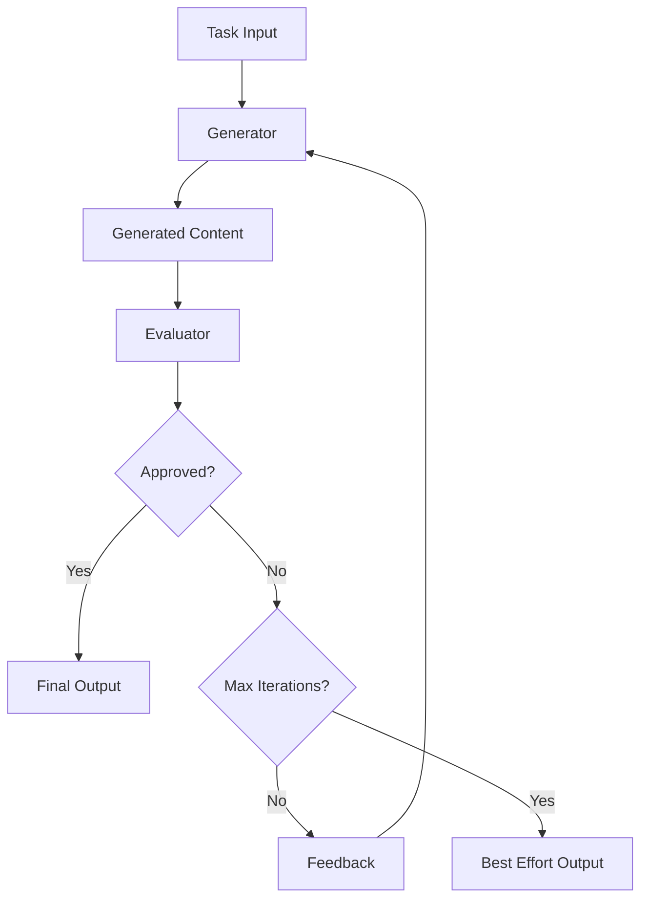
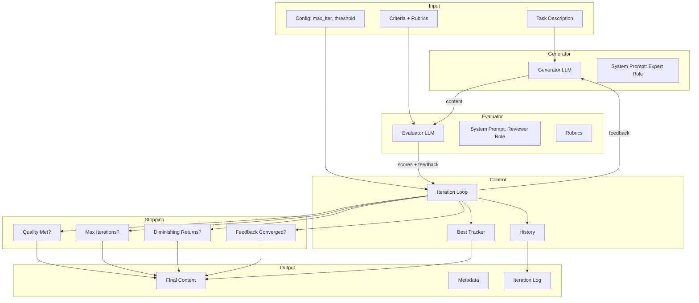
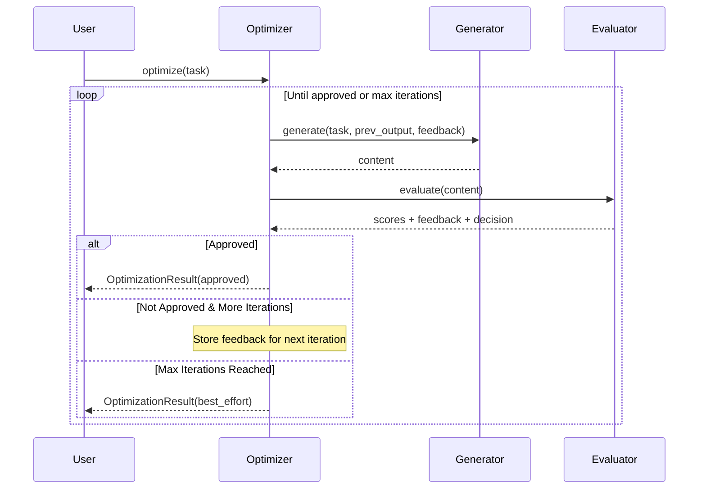
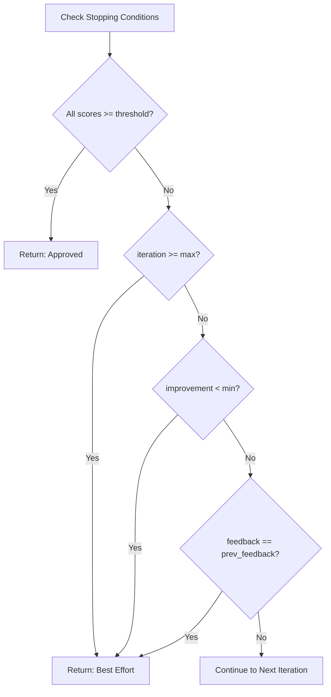
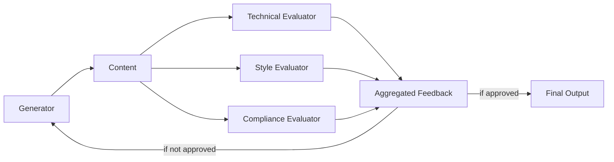

# Evaluator-Optimizer Pattern Diagrams

These diagrams can be rendered using Mermaid (supported in GitHub, VS Code, and many other tools).

## Basic Flow Diagram

## Detailed Architecture

## Iteration Flow

## Stopping Conditions Decision Tree

## Multi-Evaluator Variation

## Usage

1. **GitHub**: Mermaid diagrams render automatically in markdown files
2. **VS Code**: Install the "Markdown Preview Mermaid Support" extension
3. **Online**: Use https://mermaid.live/ to render and export
4. **Obsidian**: Native mermaid support in notes

These diagrams complement the ASCII diagrams in the chapter and can be used for presentations or documentation.
